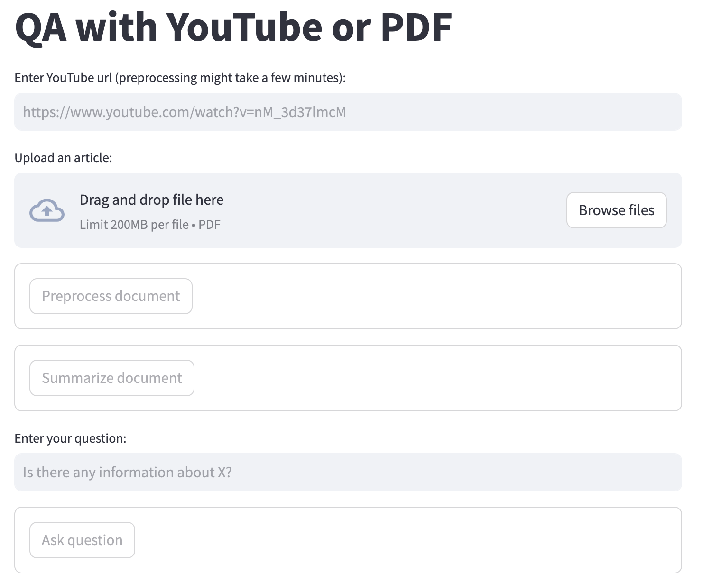

# QA retrieval for YouTube videos / PDFs

## Description

This repository provides a langchain/streamlit based app for question/answering for uploaded documents.



## Preparation

Python 3.10.12

```bash
$ pip install -r requirements.txt
```

You will also need an `openai_api_key`. Register your API key as follows.

```bash
$ OPENAI_API_KEY=sk-xxxxxxxxxxxx
```

## Usage

```bash
$ streamlit run qa-app.py
```
